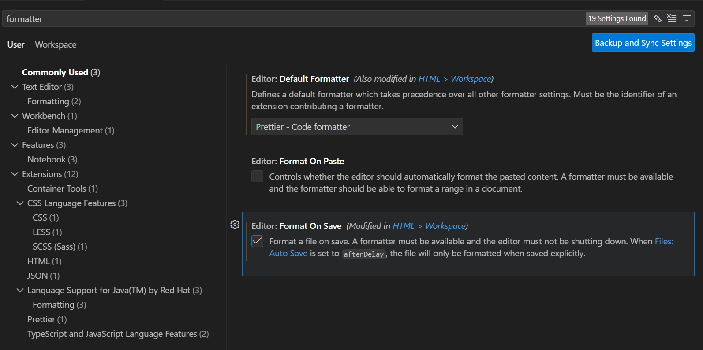

# PracticeAngular

This project was generated using [Angular CLI](https://github.com/angular/angular-cli) version 21.0.0.

## Development server

To start a local development server, run:

```bash
ng serve
```

Once the server is running, open your browser and navigate to `http://localhost:4200/`. The application will automatically reload whenever you modify any of the source files.

## Code scaffolding

Angular CLI includes powerful code scaffolding tools. To generate a new component, run:

```bash
ng generate component component-name
```

For a complete list of available schematics (such as `components`, `directives`, or `pipes`), run:

```bash
ng generate --help
```

## Building

To build the project run:

```bash
ng build
```

This will compile your project and store the build artifacts in the `dist/` directory. By default, the production build optimizes your application for performance and speed.

## Running unit tests

To execute unit tests with the [Karma](https://karma-runner.github.io) test runner, use the following command:

```bash
ng test
```

## Running end-to-end tests

For end-to-end (e2e) testing, run:

```bash
ng e2e
```

Angular CLI does not come with an end-to-end testing framework by default. You can choose one that suits your needs.

## Additional Resources

For more information on using the Angular CLI, including detailed command references, visit the [Angular CLI Overview and Command Reference](https://angular.dev/tools/cli) page.

## Add Tailwind CSS to Angular Project (Angular 21+)

### Reference

> https://angular.dev/guide/tailwind

```sh
ng add tailwindcss
```

## Switch from CSS to SCSS

**Short answer:** Yes, you can switch your Angular project from plain CSS to SCSS even with TailwindCSS configured. Tailwind and SCSS don’t conflict — Tailwind is processed via PostCSS, while SCSS is compiled by Angular’s build pipeline. The latest guidance shows they work together smoothly if you configure imports correctly.

---

## 🔎 Step‑by‑Step: Switching to SCSS with TailwindCSS

### 1. Change Angular project style to SCSS

- Update `angular.json`:
  ```json
  "styles": [
    "src/styles.scss"
  ]
  ```
- Rename `src/styles.css` → `src/styles.scss`.
- If you want component styles in SCSS, run:
  ```sh
  ng config schematics.@schematics/angular:component.style scss
  ```
  This ensures new components use `.scss`.
- In `src/styles.scss`, import Tailwind:

  ```scss
  @use 'tailwindcss';

  // Your custom SCSS after Tailwind
  body {
    font-family: sans-serif;
  }
  ```

  > ⚠️ Note: Tailwind v4 deprecated `@import "tailwindcss";` in SCSS. Use `@use "tailwindcss";` instead.

---

## ⚠️ Risks & Trade‑offs

- **Import order matters**: Always load Tailwind first (`@use "tailwindcss";`) then your SCSS overrides.
- **@apply limitations**: Tailwind’s `@apply` works in SCSS, but avoid applying responsive variants (`sm:`, `md:`) inside SCSS — use them directly in templates.
- **Build performance**: SCSS + Tailwind adds compilation steps, but Angular CLI handles them efficiently.

---

## generate a card componet to test tailwind css

Let's generate a card component with inline template and inline style

```sh
ng g c component/card --skip-tests -t -s
```

update it as:

```ts

```

## Vs Code Extension Setup

- https://marketplace.visualstudio.com/items?itemName=bradlc.vscode-tailwindcss
- https://marketplace.visualstudio.com/items?itemName=prettier.prettier-vscode

```sh
pnpm add -D prettier-plugin-tailwindcss
```

create `.prettierrc`

```
{
    "plugins": ["prettier-plugin-tailwindcssS"]
}
```

Update vs code setting

- set formatter to prettier
  

## ✅ Recommendation

- Switch your global styles to SCSS (`styles.scss`).
- Use `@use "tailwindcss";` at the top of `styles.scss`.
- Keep component styles in SCSS for nesting/variables, and use Tailwind utilities in templates.

## Add Json Server

```
pnpm add -D json-server@0.17.4
```

### Create Database File

Create a file named `db.json` in the project root:

```json
{
  "todos": [
    {
      "id": 1,
      "title": "Learn Angular 17+",
      "status": "in-progress"
    }
  ]
}
```

### Start the JSON Server

Run:

```bash
pnpm dlx json-server --watch db.json --port 3200
```

or add below to `package.json > scripts`

```
{
  "scripts": {
    "server": "json-server --watch db.json --port 3200"
  }
}
```

## Then you can run `pnpm run server`

Let’s configure a proxy for the api exposed by the json server.
In Angular, **a proxy configuration file** is commonly used to avoid CORS issues during development, and it can be wired via **`angular.json` (Angular CLI)** or indirectly via **npm scripts in `package.json`**.

---

## Why Proxy Configuration?

During development:

- Angular app → `http://localhost:4200`
- JSON Server → `http://localhost:3200`

The browser blocks this due to **CORS**.

A **proxy** lets Angular forward API calls to another backend **as if they were same-origin**.

---

## 1. Create Proxy Configuration File

Create a file at project root:

`proxy.conf.json`

```json
{
  "/api": {
    "target": "http://localhost:3200",
    "secure": false,
    "changeOrigin": true,
    "logLevel": "debug"
  }
}
```

### What this does

- Any request starting with `/api`
- Is forwarded to `http://localhost:3200`
- `/api/posts` → `http://localhost:3200/posts`

---

## 2. Use Proxy in `angular.json` (Recommended)

Open `angular.json` and update the **serve** options:

```json
{
  "projects": {
    "your-app-name": {
      "architect": {
        "serve": {
          "options": {
            "proxyConfig": "proxy.conf.json"
          }
        }
      }
    }
  }
}
```

> This is the **official and recommended** Angular CLI approach.

---

## 3. (Optional) Use Proxy via `package.json`

Instead of hardcoding in `angular.json`, you can pass it via CLI:

`package.json`

```json
{
  "scripts": {
    "start": "ng serve --proxy-config proxy.conf.json"
  }
}
```

Then run:

```bash
npm start
```

This approach is useful when:

- You want **different proxies for different environments**
- You don’t want to touch `angular.json`

---

## 4. Update API Calls in Services

Now change your service URLs to use `/api`.

### Before

```ts
private apiUrl = 'http://localhost:3200/todos';
```

### After

```ts
private apiUrl = '/api/todos';
```

Angular dev server will proxy this automatically.

---

## 5. Important Notes

- Proxy works **only with `ng serve`**
- It is **not used in production builds**
- In production, APIs should be handled via:
  - Environment configs (`environment.ts`)
  - Reverse proxy (NGINX, Apache, etc.)

---

## Quick Comparison

| Method         | When to Use                          |
| -------------- | ------------------------------------ |
| `angular.json` | Default, clean, team-friendly        |
| `package.json` | Multiple proxy configs / flexibility |
| No proxy       | Only if backend handles CORS         |

---
